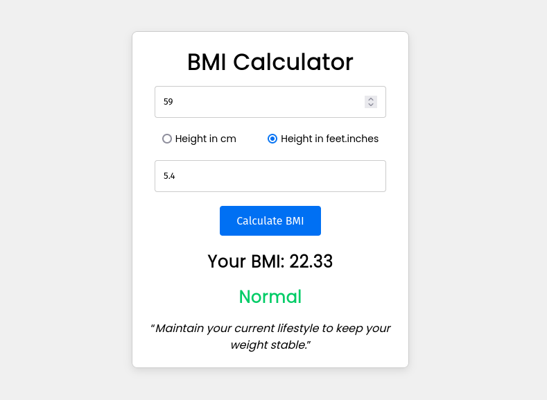

# BMI Calculator

This project is a simple Body Mass Index (BMI) Calculator built using Next.js and raw CSS. It allows users to input their weight and height to calculate their BMI and receive fitness advice based on the result.



## Features

- **BMI Calculation**: Input weight and height to calculate your BMI.
- **Fitness Advice**: Receive personalized advice based on your BMI category.
- **Responsive Design**: User-friendly interface that works on both desktop and mobile devices.

## Installation

To get started with the BMI Calculator, follow these steps:

1. **Clone the repository**:
   ```bash
   git clone https://github.com/maruf-pfc/bmi-calculator.git
   cd bmi-calculator
   ```

2. **Install dependencies**:
   ```bash
   npm install
   ```

3. **Run the development server**:
   ```bash
   npm run dev
   ```

4. Open your browser and visit `http://localhost:3000` to see the application in action.

## Usage

- Enter your weight in kilograms.
- Enter your height in centimeters or feet and inches.
- Click the "Calculate BMI" button to see your BMI and receive fitness advice.

## Contributing

Contributions are welcome! If you have suggestions or improvements, feel free to open an issue or submit a pull request.

## License

This project is licensed under the MIT License. See the [LICENSE](LICENSE) file for more details.

## Acknowledgments

- Built with [Next.js](https://nextjs.org/)
- Styling with raw CSS
